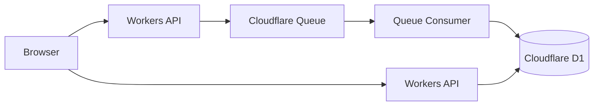

# Cloudflare Workers Queue + D1 Sample

> mono-template
> Design & Development Sandbox

Cloudflare Workers / Queue / D1 を利用した
イベント駆動型システムのサンプルプロジェクトです。

本リポジトリは単なるサンプルコードではなく、
概念設計からテスト仕様まで含めた
技術検証用テンプレートとして作成しています。

---

# 概要

本プロジェクトでは、
Cloudflare のマネージドサービスを利用し、
低コストなイベント駆動型システムを構築します。

主な学習対象

* Cloudflare Workers
* Cloudflare Queue
* Cloudflare D1
* イベント駆動アーキテクチャ
* 非同期処理
* Web API

---

# システム構成



---

# 主な機能

* イベント送信
* Queue登録
* 非同期イベント処理
* D1保存
* イベント件数表示
* イベント一覧表示

---

# ディレクトリ構成

```text
# ディレクトリ構成

```text
/
├─ docs/
├─ source/
│  ├─ public/
│  ├─ src/
│  ├─ migrations/
│  ├─ terraform/
│  │  └─ base/
│  │      ├─ main.tf
│  │      ├─ variables.tf
│  │      ├─ outputs.tf
│  │      ├─ local_file.tf
│  │      ├─ terraform.tfvars.example
│  │      └─ README.md
│  │
│  ├─ package.json
│  └─ README.md
│
├─ README.md
└─ LICENSE
```


Terraform 実行時に Cloudflare Queue / D1 Database を作成し、
wrangler.jsonc を自動生成します。

docs/docs は PDF生成テンプレートの構成に合わせた配置です。

---

# 設計書一覧

本プロジェクトでは、
設計工程を学習できるよう
各種設計書を同梱しています。

## プロジェクト管理

```text
docs/project-management/
├─ project-plan.md
└─ risk-register.md
```

---

## 概念設計

```text
docs/concept/
└─ concept-design.md
```

---

## 基本設計

```text
docs/design/
├─ specifications.md
└─ system-architecture.md
```

---

## 外部設計

```text
docs/ui/
├─ screen-flow.md
└─ UI_0101_EventMonitor.md
```

---

## 内部設計

```text
docs/internal/
├─ internal-api-spec.md
├─ internal-queue-design.md
└─ internal-design-db.md
```

---

## テスト

```text
docs/test/
├─ test-plan.md
└─ test-spec.md
```

---

# 開発環境

| 項目       | 内容                 |
| -------- | ------------------ |
| Runtime  | Cloudflare Workers |
| Queue    | Cloudflare Queue   |
| Database | Cloudflare D1      |
| Language | JavaScript         |
| IaC      | Terraform          |
| Tool     | Wrangler           |

---

# セットアップ

## リポジトリ取得

```bash
git clone <repository-url>
cd mono-template-cloudflare-workers-queue-d1/source
```

---

## 依存関係インストール

```bash
npm install
```

---

## Cloudflare環境構築

Terraformを利用してCloudflareリソースを作成します。

```bash
cd terraform/base

terraform init
terraform validate
terraform plan
terraform apply
```

実行後、

* Cloudflare Queue
* Cloudflare D1 Database
* wrangler.jsonc

が自動生成されます。

---

## ローカル実行

```bash
npm run dev
```

---

## D1テーブル作成（ローカル）

```bash
npx wrangler d1 execute event-db --local --file=./migrations/0001_create_event_log.sql
```

---

## Deploy

```bash
npm run deploy
```

---

## D1テーブル作成（リモート）

```bash
npx wrangler d1 execute event-db --remote --file=./migrations/0001_create_event_log.sql
```

---

# 環境削除

Cloudflare Queue と Worker Consumer は相互参照されるため、

```bash
terraform destroy
```

のみでは削除できない場合があります。

その場合は以下の順番で削除してください。

## 1. Queue Consumer の紐づけ解除

```bash
npx wrangler queues consumer worker remove event-queue event-driven-sample
```

---

## 2. Worker を削除

```bash
npx wrangler delete event-driven-sample
```

---

## 3. Terraform 管理リソースを削除

```bash
cd terraform/base

terraform destroy
```

---

## 補足

Cloudflare Queue は Consumer として Worker を参照します。

また、Worker は Queue Binding を参照します。

そのため、

```text
Queue
↓
Worker Consumer
↓
Worker
↓
Queue Binding
```

の関係が残っている状態では削除できません。

先に Queue Consumer の紐づけを解除してから Worker を削除してください。

---

# 対象読者

本リポジトリは以下の方を対象としています。

* Cloudflare を学習したい方
* Queue を学習したい方
* D1 を学習したい方
* イベント駆動システムを学習したい方
* 設計書付きサンプルを探している方

---

# 想定しない内容

本リポジトリは技術検証用サンプルです。

以下は対象外としています。

* 本番運用設計
* 高可用性構成
* 大規模負荷試験
* 高度な認証機能

---

# mono-template について

mono-template は、

「設計 → 実装 → テスト」

までを含めた
技術検証用テンプレートシリーズです。

今後も以下のようなテーマを追加予定です。

* Azure Static Web Apps
* Cloudflare R2
* MQTT
* PLC DB Integration
* .NET WinForms

---

# License

MIT License

---

# Author

mono-tec Dev
