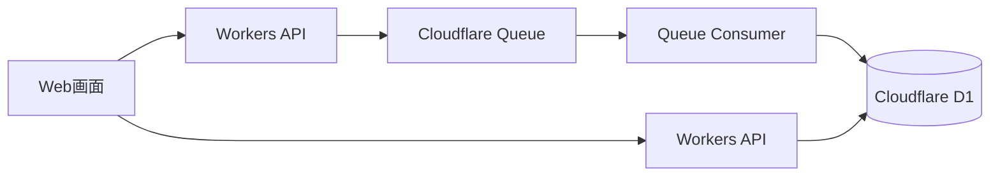

<!-- 表紙 -->
<div class="cover">
  <div class="title">クラウドサービス活用型イベント駆動システム<BR>基本仕様書</div>
  <div class="version">v1.0.0</div>
  <div class="date">2026-05-29</div>
  <div class="logo">


  </div>
  <div class="copyright">
    © mono-tec Dev
  </div>
</div>

<div class="page-break"></div>

<!-- omit from toc -->

# 1. 文書概要

本書は、
概念設計書で整理した
「低コストで小規模に開始できるクラウドサービス活用型の技術検証用箱庭」
を実現するための基本設計を整理する。

本書では、
採用するシステム構成、取り扱う情報、提供する機能範囲を定義する。

画面仕様、API仕様、Queue仕様、Database仕様については、
それぞれ別紙で定義する。

# 2. 基本方針

本システムでは、
小規模な Web サービスを低コストかつ低運用負荷で構築するため、
クラウドサービスを活用した構成を採用する。

従来のようにサーバを個別に構築・運用するのではなく、
クラウドサービスが提供する以下機能を組み合わせて利用する。

* 静的 Web 画面の公開
* API 実行基盤
* メッセージング
* データ保存
* 自動デプロイ

これにより、
小規模な検証環境や学習用サービスを、
少ない運用負荷で構築できることを確認する。

# 3. クラウド型を選択する理由

本システムでクラウド型構成を選択する理由は以下の通りである。

| No | 理由          | 内容                                  |
| -- | ----------- | ----------------------------------- |
| 1  | 初期コストを抑えやすい | サーバ購入や専用インフラ構築を行わずに開始できる            |
| 2  | 小規模に始めやすい   | 利用者数が少ない検証用途でも構成しやすい                |
| 3  | 運用負荷を抑えやすい  | OS管理やサーバ保守をクラウドサービス側に寄せられる          |
| 4  | 機能拡張しやすい    | API、Queue、Database、Storage 等へ拡張しやすい |
| 5  | 学習・検証に向いている | 小さな構成で試しながら段階的に理解できる                |

# 4. 採用サービス方針

本システムでは、
クラウドサービスを利用した小規模イベント駆動型システムの実現手段として、
Cloudflare の各サービスを採用候補とする。

Cloudflare は CDN やセキュリティサービスとして広く利用されており、
Web サービス公開基盤として一定の知名度がある。

また、Workers、Queue、D1、R2 など、
小規模な Web サービスやイベント駆動型システムを構成するための機能を提供している。

本システムでは、まず以下を利用する。

| サービス                             | 用途              |
| -------------------------------- | --------------- |
| Cloudflare Workers               | API 実行、イベント受付   |
| Cloudflare Queue                 | イベントの一時保持、非同期処理 |
| Cloudflare D1                    | イベント履歴、集計情報の保存  |
| Cloudflare Workers Static Assets | 静的 Web 画面の公開    |

# 5. サービス概要

本システムでは、
画面上の操作を疑似イベントとして扱い、
イベントを受け付け、非同期処理し、結果を保存・表示する。

利用者は Web 画面からイベント送信を行い、
システムはそのイベントを Queue に登録する。

Queue に登録されたイベントは、
Consumer 処理により Database へ保存される。

また、利用者は Web 画面上で、
イベント件数や最新イベントを確認できる。

# 6. 取り扱う情報

本システムでは、
以下の情報を取り扱う。

| 情報      | 内容                     |
| ------- | ---------------------- |
| イベント情報  | 画面操作や外部通知を表す情報         |
| イベント種別  | どの種類のイベントかを表す区分        |
| 発生日時    | イベントが発生した日時            |
| 処理日時    | Queue Consumer が処理した日時 |
| メッセージ内容 | イベントに付随する任意の文字列        |
| 処理結果    | 正常処理されたかどうかの状態         |
| 付加情報    | 将来拡張用の JSON 形式データ      |

# 7. データ形式方針

本システムでは、
API および Queue メッセージのデータ形式として JSON を利用する。

JSON を利用する理由は以下の通りである。

* Web API と相性が良い
* JavaScript / Workers で扱いやすい
* 将来的な項目追加に対応しやすい
* IoT / Webhook / 外部 API 連携へ拡張しやすい

イベント情報の基本形式は以下を想定する。

```json
{
  "eventType": "button_click",
  "message": "sample event",
  "occurredAt": "2026-05-29T10:00:00.000Z",
  "payload": {
    "source": "web-ui"
  }
}
```

詳細なリクエスト形式、レスポンス形式、Queue メッセージ形式は、
API仕様書およびQueue仕様書で定義する。

# 8. システム全体構成

本システムの基本構成は以下とする。



# 9. 機能概要

本システムでは、
以下機能を提供する。

| No | 機能       | 内容                       |
| -- | -------- | ------------------------ |
| 1  | イベント送信   | Web画面から疑似イベントを送信する       |
| 2  | イベント受付   | APIでイベントを受け付ける           |
| 3  | Queue登録  | 受け付けたイベントをQueueへ登録する     |
| 4  | イベント処理   | Queue Consumerがイベントを処理する |
| 5  | イベント保存   | 処理済みイベントをD1へ保存する         |
| 6  | 件数表示     | 保存済みイベント件数を画面に表示する       |
| 7  | 最新イベント表示 | 最新イベント一覧を画面に表示する         |

# 10. 画面概要

本システムでは、
シンプルな検証用画面を提供する。

画面では以下を行う。

* イベント送信
* イベント件数表示
* 最新イベント一覧表示

画面レイアウト、入力項目、表示項目、イベント仕様については、
別紙「画面仕様書」にて定義する。

# 11. API概要

本システムでは、
Workers API を利用して以下処理を提供する。

* イベント受付
* イベント件数取得
* 最新イベント一覧取得

API のエンドポイント、リクエスト、レスポンス、エラー仕様については、
別紙「API仕様書」にて定義する。

# 12. Queue概要

本システムでは、
イベント処理を非同期化するため Queue を利用する。

Queue では、
API で受け付けたイベント情報を一時保持し、
Consumer 処理へ受け渡す。

Queue 名、メッセージ形式、Consumer 処理、エラー時の扱いについては、
別紙「Queue仕様書」にて定義する。

# 13. Database概要

本システムでは、
イベント履歴および集計情報を保持するため、
D1 Database を利用する。

保存対象は以下とする。

* イベント履歴
* イベント種別
* 発生日時
* 処理日時
* メッセージ内容
* 処理結果
* 付加情報

テーブル定義、カラム定義、インデックス、初期データについては、
別紙「Database設計書」にて定義する。

# 14. 想定ディレクトリ構成

本システムでは、
設計書と実装を分離管理するため、
以下構成を採用する。

```text
/
├─ docs/
│  └─ docs/
│     ├─ concept/
│     ├─ design/
│     ├─ internal/
│     └─ ui/
├─ src/
│  └─ public/
├─ functions/
├─ .gitignore
├─ LICENSE
├─ README.md
└─ wrangler.jsonc
```

# 15. 非機能要件

## 15.1 動作環境

本システムは以下環境で動作することを想定する。

* Cloudflare Workers
* Cloudflare Queue
* Cloudflare D1
* Node.js
* Webブラウザ

---

## 15.2 運用方針

本システムは、
学習・検証用途を主目的とする。

そのため、
本格的な本番運用ではなく、
小規模な技術検証環境として運用する。

# 16. 制約事項

本システムは、
技術検証用サンプルとして作成する。

以下は対象外とする。

* 本格認証
* 高度な権限管理
* 高度な排他制御
* 本番運用設計
* 大規模負荷対応
* SLA設計

# 17. 改訂履歴

| 版数     | 改定日        | 内容   |
| ------ | ---------- | ---- |
| v1.0.0 | 2026-05-29 | 初版作成 |
