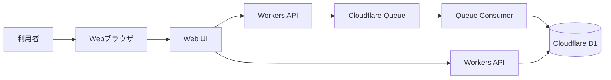
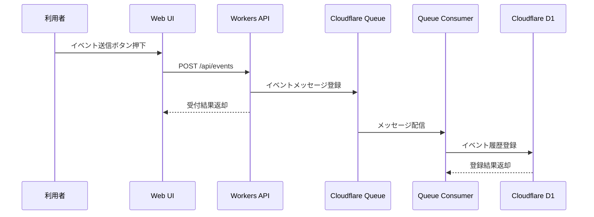
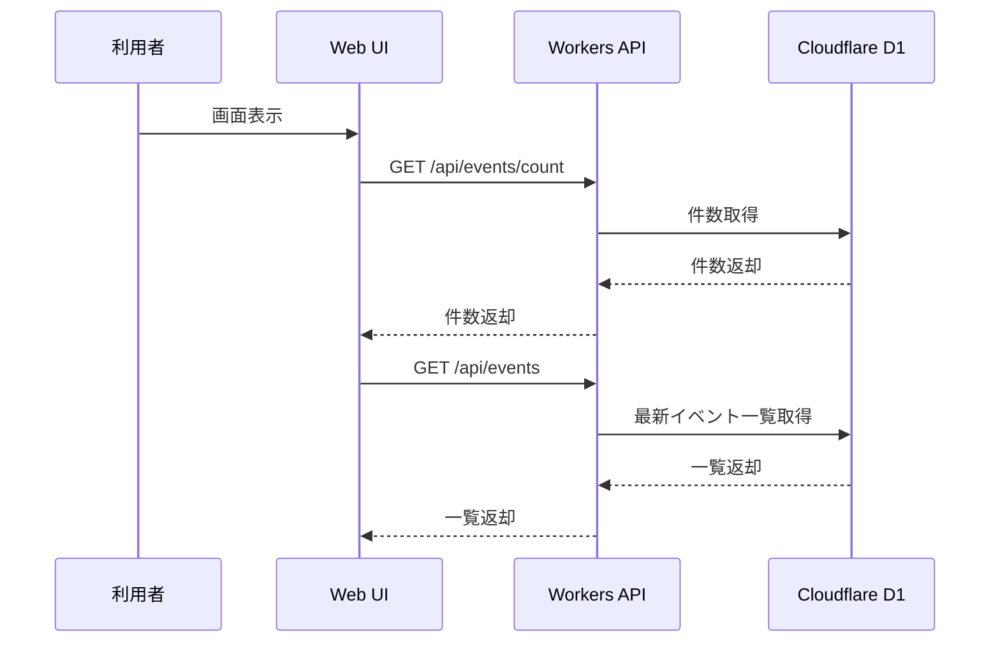

<!-- 表紙 -->
<div class="cover">
  <div class="title"> Cloudflare Workers Queue + D1 システム構成設計書</div>
  <div class="version">v1.0.0</div>
  <div class="date">2026-05-29</div>
  <div class="logo">

   

  </div>
  <div class="copyright">
    © mono-tec Dev
  </div>
</div>

<div class="page-break"></div>

<!-- omit from toc -->


# 1. 文書概要

本書は、
Cloudflare Workers Queue + D1 サンプルシステムの
システム構成を整理することを目的とする。

本書では、
論理構成、Cloudflare サービス構成、データフローを定義する。

詳細な画面仕様、API仕様、Queue仕様、Database仕様については、
各設計書にて定義する。

---

# 2. システム構成方針

本システムでは、
小規模なイベント駆動型 Web サービスを
低コストかつ低運用負荷で構築するため、
Cloudflare の各サービスを利用する。

主な構成要素は以下とする。

| 構成要素             | 役割            |
| ---------------- | ------------- |
| Web UI           | 利用者向け画面       |
| Workers API      | イベント受付、データ取得  |
| Cloudflare Queue | イベントの一時保持     |
| Queue Consumer   | Queue メッセージ処理 |
| Cloudflare D1    | イベント履歴保存      |

---

# 3. 論理構成図



---

# 4. Cloudflare サービス構成

本システムで利用する Cloudflare サービスは以下とする。

```text
Cloudflare
├─ Workers
│  ├─ Workers API
│  └─ Queue Consumer
│
├─ Queue
│  └─ event-queue
│
├─ D1
│  └─ event_log
│
└─ Workers Static Assets
   └─ Web UI
```

---

# 5. データフロー

## 5.1 イベント送信フロー



---

## 5.2 イベント表示フロー



---

# 6. コンポーネント構成

## 6.1 Web UI

| 項目    | 内容               |
| ----- | ---------------- |
| 配置場所  | public           |
| 役割    | イベント送信、件数表示、一覧表示 |
| 関連設計書 | UI設計書            |

---

## 6.2 Workers API

| 項目    | 内容                                                       |
| ----- | -------------------------------------------------------- |
| 配置場所  | functions                                                |
| 役割    | APIリクエスト受付                                               |
| 主なAPI | POST /api/events, GET /api/events, GET /api/events/count |
| 関連設計書 | API内部設計書                                                 |

---

## 6.3 Cloudflare Queue

| 項目     | 内容             |
| ------ | -------------- |
| Queue名 | event-queue    |
| 役割     | イベントメッセージの一時保持 |
| 関連設計書  | Queue内部設計書     |

---

## 6.4 Queue Consumer

| 項目    | 内容                       |
| ----- | ------------------------ |
| 役割    | Queueメッセージを受信し、D1へ保存する   |
| 入力    | Queueメッセージ               |
| 出力    | D1 Database              |
| 関連設計書 | Queue内部設計書、Database内部設計書 |

---

## 6.5 Cloudflare D1

| 項目       | 内容            |
| -------- | ------------- |
| Database | Cloudflare D1 |
| 役割       | イベント履歴保存      |
| 主なテーブル   | event_log     |
| 関連設計書    | Database内部設計書 |

---

# 7. ディレクトリ構成

```text
/
├─ docs/
│  └─ cf-workers-event-sample/
│     ├─ concept/
│     ├─ design/
│     │  ├─ specifications.md
│     │  └─ system-architecture.md
│     ├─ internal/
│     ├─ project-management/
│     ├─ test/
│     └─ ui/
│
├─ public/
│  ├─ index.html
│  ├─ script.js
│  └─ styles.css
│
├─ functions/
│  └─ api/
│     └─ events.js
│
├─ .gitignore
├─ LICENSE
├─ README.md
└─ wrangler.jsonc
```

---

# 8. Binding 構成

本システムでは、
Workers から Queue および D1 を利用するため、
以下 Binding を設定する。

| Binding名    | 種別          | 用途          |
| ----------- | ----------- | ----------- |
| EVENT_QUEUE | Queue       | イベントメッセージ登録 |
| DB          | D1 Database | イベント履歴保存・参照 |

---

# 9. 構成上の注意事項

* Queue 処理は非同期で行われる
* イベント送信直後に D1 へ反映されない場合がある
* UI は API 経由で D1 の内容を取得する
* D1 への直接アクセスは行わない
* 本構成は技術検証用であり、本番運用設計は対象外とする

---

# 10. 将来拡張

本構成をベースとして、
以下拡張を想定できる。

| 拡張項目        | 内容              |
| ----------- | --------------- |
| R2連携        | ファイル保存          |
| Webhook受付   | 外部サービスからのイベント受信 |
| MQTT連携      | IoTイベント受信       |
| 認証追加        | 管理画面やAPI利用制限    |
| WebSocket連携 | リアルタイム表示        |
| Worker AI連携 | イベント内容の分析       |

---

# 11. 関連設計書

* 概念設計書
* 基本設計書
* UI設計書
* API内部設計書
* Queue内部設計書
* Database内部設計書
* テスト計画書

---

# 12. 改訂履歴

| 版数     | 改定日        | 内容   |
| ------ | ---------- | ---- |
| v1.0.0 | 2026-05-30 | 初版作成 |
