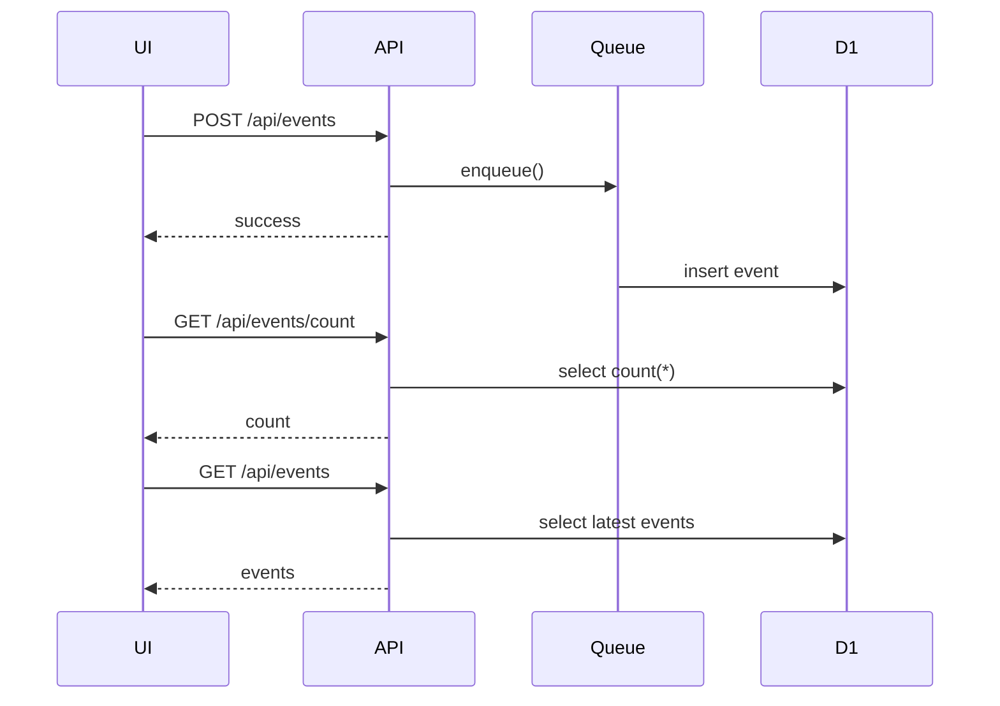

<!-- 表紙 -->
<div class="cover">
  <div class="title">Cloudflare Workers Queue + D1<BR>API内部設計書</div>
  <div class="version">v1.0.0</div>
  <div class="date">2026-05-29</div>
  <div class="logo">


  </div>
  <div class="copyright">
    © mono-tec Dev
  </div>
</div>

<div class="page-break"></div>

<!-- omit from toc -->

# 1. 文書概要

本書は、
Cloudflare Workers Queue + D1 サンプルシステムで利用する
API の内部設計を定義する。

本書は開発者向け資料とし、
API のリクエスト・レスポンス仕様および処理内容を定義する。

# 2. API一覧

| No | Method | Path              | 概要       |
| -- | ------ | ----------------- | -------- |
| 1  | POST   | /api/events       | イベント送信   |
| 2  | GET    | /api/events       | イベント一覧取得 |
| 3  | GET    | /api/events/count | イベント件数取得 |

# 3. 共通仕様

## 3.1 データ形式

Request

```json
{
}
```

Response

```json
{
}
```

すべて JSON 形式で送受信する。

---

## 3.2 Content-Type

```text
application/json
```

---

## 3.3 文字コード

```text
UTF-8
```

# 4. API詳細

## 4.1 POST /api/events

### 概要

疑似イベントを受信し、
Cloudflare Queue へ登録する。

---

### Request

#### Request Body

```json
{
  "eventType": "button_click",
  "message": "sample event",
  "payload": {
    "source": "web-ui"
  }
}
```

---

#### Request項目

| 項目        | 型      | 必須 | 内容        |
| --------- | ------ | -- | --------- |
| eventType | string | ○  | イベント種別    |
| message   | string | ○  | イベントメッセージ |
| payload   | object | -  | 任意データ     |

---

### Response

#### 正常時

```json
{
  "success": true,
  "message": "Event queued."
}
```

---

#### 異常時

```json
{
  "success": false,
  "message": "Invalid request."
}
```

---

### 処理概要

```text
Request受信
↓
入力チェック
↓
Queue登録
↓
Response返却
```

---

## 4.2 GET /api/events

### 概要

D1 Database から
最新イベント一覧を取得する。

---

### Request

なし

---

### Response

```json
{
  "events": [
    {
      "id": 1,
      "eventType": "button_click",
      "message": "sample event",
      "createdAt": "2026-05-30T10:00:00Z"
    }
  ]
}
```

---

### Response項目

#### events

| 項目        | 型      | 内容     |
| --------- | ------ | ------ |
| id        | number | イベントID |
| eventType | string | イベント種別 |
| message   | string | メッセージ  |
| createdAt | string | 登録日時   |

---

### 処理概要

```text
D1検索
↓
最新10件取得
↓
JSON返却
```

---

## 4.3 GET /api/events/count

### 概要

D1 Database に保存されている
イベント件数を取得する。

---

### Request

なし

---

### Response

```json
{
  "count": 123
}
```

---

### Response項目

| 項目    | 型      | 内容     |
| ----- | ------ | ------ |
| count | number | イベント件数 |

---

### 処理概要

```text
D1件数取得
↓
JSON返却
```

# 5. HTTPステータス

| Status | 内容      |
| ------ | ------- |
| 200    | 正常      |
| 400    | リクエスト不正 |
| 500    | サーバエラー  |

# 6. エラー仕様

## 共通エラー形式

```json
{
  "success": false,
  "errorCode": "ERR001",
  "message": "Internal Server Error"
}
```

---

## エラー一覧

| コード    | 内容        |
| ------ | --------- |
| ERR001 | リクエスト不正   |
| ERR002 | Queue登録失敗 |
| ERR003 | D1取得失敗    |
| ERR004 | システムエラー   |

# 7. API利用フロー



# 8. 関連設計書

* 基本仕様書
* Queue内部設計書
* Database内部設計書
* UI設計書

# 9. 改訂履歴

| 版数     | 改定日        | 内容   |
| ------ | ---------- | ---- |
| v1.0.0 | 2026-05-30 | 初版作成 |
