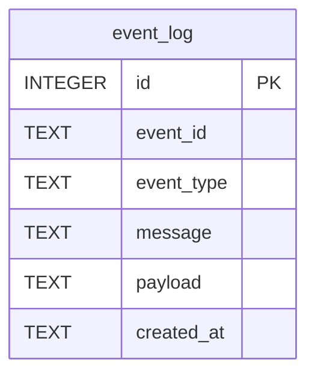

<!-- 表紙 -->
<div class="cover">
  <div class="title">Cloudflare Workers Queue + D1<BR>Database内部設計書</div>
  <div class="version">v1.0.0</div>
  <div class="date">2026-05-29</div>
  <div class="logo">


  </div>
  <div class="copyright">
    © mono-tec Dev
  </div>
</div>

<div class="page-break"></div>

<!-- omit from toc -->

# 1. 文書概要

本書は、
Cloudflare Workers Queue + D1 サンプルシステムで利用する
D1 Database の内部設計を定義する。

本書は開発者向け資料とし、
テーブル構造、カラム定義、インデックス設計およびデータ保持方針を定義する。

# 2. データベース概要

## 2.1 採用技術

| 項目       | 内容                           |
| -------- | ---------------------------- |
| Database | Cloudflare D1                |
| Engine   | SQLite                       |
| 用途       | イベント履歴保存                     |
| 利用方式     | Queue Consumer から登録、API から参照 |

---

## 2.2 利用目的

本システムでは以下用途で利用する。

* イベント履歴保存
* イベント件数集計
* 最新イベント一覧取得
* 将来分析用データ蓄積

# 3. テーブル一覧

| テーブル名     | 用途       |
| --------- | -------- |
| event_log | イベント履歴管理 |

# 4. ER図



# 5. テーブル定義

## 5.1 event_log

### テーブル概要

イベント履歴を保存する。

---

### カラム定義

| No | カラム名       | 型       | PK | NULL | 内容       |
| -- | ---------- | ------- | -- | ---- | -------- |
| 1  | id         | INTEGER | ○  | ×    | 自動採番     |
| 2  | event_id   | TEXT    | -  | ×    | イベント識別子  |
| 3  | event_type | TEXT    | -  | ×    | イベント種別   |
| 4  | message    | TEXT    | -  | ×    | イベント内容   |
| 5  | payload    | TEXT    | -  | ○    | JSON文字列  |
| 6  | created_at | TEXT    | -  | ×    | イベント発生日時 |

---

### 主キー

```text
id
```

---

### 一意制約

なし

# 6. DDL

## event_log

```sql
CREATE TABLE IF NOT EXISTS event_log
(
    id INTEGER PRIMARY KEY AUTOINCREMENT,

    event_id TEXT NOT NULL,

    event_type TEXT NOT NULL,

    message TEXT NOT NULL,

    payload TEXT,

    created_at TEXT NOT NULL
);
```

# 7. インデックス設計

## IDX_EVENT_LOG_CREATED_AT

```sql
CREATE INDEX IF NOT EXISTS
IDX_EVENT_LOG_CREATED_AT
ON event_log(created_at DESC);
```

---

## 利用目的

```text
最新イベント一覧取得高速化
```

# 8. データ登録仕様

## 登録元

```text
Cloudflare Queue Consumer
```

---

## 登録タイミング

```text
Queue受信時
```

---

## 登録内容

```json
{
  "eventId": "evt-001",
  "eventType": "button_click",
  "message": "sample event",
  "payload": {
    "source": "web-ui"
  },
  "createdAt": "2026-05-30T10:00:00Z"
}
```

# 9. データ取得仕様

## 9.1 イベント件数取得

### SQL

```sql
SELECT COUNT(*)
FROM event_log;
```

---

## 9.2 最新イベント一覧取得

### SQL

```sql
SELECT
    id,
    event_id,
    event_type,
    message,
    payload,
    created_at
FROM
    event_log
ORDER BY
    created_at DESC
LIMIT 10;
```

# 10. データ保持方針

本システムは技術検証用途とするため、
データ削除処理は実装しない。

---

## 将来拡張

将来的に以下機能追加を想定する。

* 保持期間管理
* 自動削除
* アーカイブ機能
* イベント種別別集計
* 統計分析

# 11. 障害時対応

## D1接続失敗

対応方針

```text
エラーログ出力
処理中断
```

---

## SQL実行失敗

対応方針

```text
エラーログ出力
異常終了
```

# 12. バックアップ方針

本システムは技術検証用途のため、
バックアップ取得は対象外とする。

# 13. 関連設計書

* 基本仕様書
* API内部設計書
* Queue内部設計書
* UI設計書

# 14. 改訂履歴

| 版数     | 改定日        | 内容   |
| ------ | ---------- | ---- |
| v1.0.0 | 2026-05-30 | 初版作成 |
