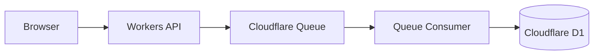
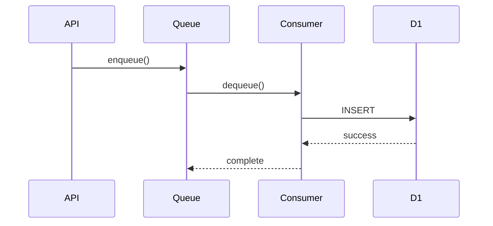

---

document_title: Cloudflare Workers Queue + D1 Queue内部設計書
dest: ./output/internal/internal-queue-design_v1.0.0.pdf
---

<!-- 表紙 -->
<div class="cover">
  <div class="title">Cloudflare Workers Queue + D1<BR>Queue内部設計書</div>
  <div class="version">v1.0.0</div>
  <div class="date">2026-05-29</div>
  <div class="logo">


  </div>
  <div class="copyright">
    © mono-tec Dev
  </div>
</div>

# 1. 文書概要

本書は、
Cloudflare Workers Queue + D1 サンプルシステムで利用する
Queue 処理の内部設計を定義する。

本書は開発者向け資料とし、
Queue の役割、メッセージ形式、Consumer 処理内容を定義する。

# 2. 目的

本システムでは、
イベント処理を非同期化するため
Cloudflare Queue を利用する。

目的は以下とする。

* API応答高速化
* イベント一時蓄積
* 非同期処理実現
* D1負荷分散
* イベント処理疎結合化

# 3. 全体構成



# 4. Queue一覧

| Queue名      | 用途        |
| ----------- | --------- |
| event-queue | イベント処理キュー |

# 5. メッセージ仕様

## 5.1 メッセージ形式

```json
{
  "eventId": "evt-001",
  "eventType": "button_click",
  "message": "sample event",
  "createdAt": "2026-05-30T10:00:00Z",
  "payload": {
    "source": "web-ui"
  }
}
```

---

## 5.2 項目仕様

| 項目        | 型      | 必須 | 内容       |
| --------- | ------ | -- | -------- |
| eventId   | string | ○  | イベント識別子  |
| eventType | string | ○  | イベント種別   |
| message   | string | ○  | イベント内容   |
| createdAt | string | ○  | イベント発生日時 |
| payload   | object | -  | 任意データ    |

# 6. Queue登録処理

## 概要

イベント送信APIから受信したイベントを
Queueへ登録する。

---

## 処理フロー

```text
POST /api/events
↓
入力チェック
↓
メッセージ生成
↓
Queue登録
↓
API応答
```

---

## 登録サンプル

```javascript
await env.EVENT_QUEUE.send({
  eventId: crypto.randomUUID(),
  eventType: body.eventType,
  message: body.message,
  createdAt: new Date().toISOString(),
  payload: body.payload
});
```

# 7. Consumer処理

## 概要

Queueへ登録されたイベントを取得し、
D1 Databaseへ保存する。

---

## 処理フロー

```text
Queue受信
↓
メッセージ取得
↓
入力チェック
↓
D1登録
↓
処理完了
```

---

## シーケンス図



# 8. Consumer登録処理

## 保存対象

| 項目        |
| --------- |
| eventId   |
| eventType |
| message   |
| createdAt |
| payload   |

---

## サンプル処理

```javascript
for (const message of batch.messages)
{
    const event = message.body;

    await env.DB.prepare(
        `
        INSERT INTO event_log
        (
            event_id,
            event_type,
            message,
            payload,
            created_at
        )
        VALUES
        (
            ?,
            ?,
            ?,
            ?,
            ?
        )
        `
    )
    .bind(
        event.eventId,
        event.eventType,
        event.message,
        JSON.stringify(event.payload),
        event.createdAt
    )
    .run();
}
```

# 9. エラー処理

## Queue登録失敗

### 内容

Queue登録に失敗した場合

### 対応

* エラーログ出力
* APIへエラー返却

---

## D1登録失敗

### 内容

Consumer処理中にD1登録失敗

### 対応

* エラーログ出力
* 再試行はCloudflare Queue標準機能へ委任

# 10. 再試行方針

Cloudflare Queue の標準機能を利用する。

| 項目                | 方針        |
| ----------------- | --------- |
| Retry             | Queue標準機能 |
| Dead Letter Queue | 未使用       |
| 手動再送              | 対象外       |

# 11. 性能方針

本システムは技術検証用途とする。

そのため、

* 高負荷試験
* スループット保証
* SLA保証

は対象外とする。

# 12. 将来拡張

本設計をベースとして
以下拡張を想定する。

* MQTTイベント受付
* PLC状態通知
* Webhook受付
* Dead Letter Queue導入
* 複数Queue対応
* イベント優先度制御

# 13. 関連設計書

* 基本仕様書
* API内部設計書
* Database内部設計書
* UI設計書

# 14. 改訂履歴

| 版数     | 改定日        | 内容   |
| ------ | ---------- | ---- |
| v1.0.0 | 2026-05-30 | 初版作成 |
