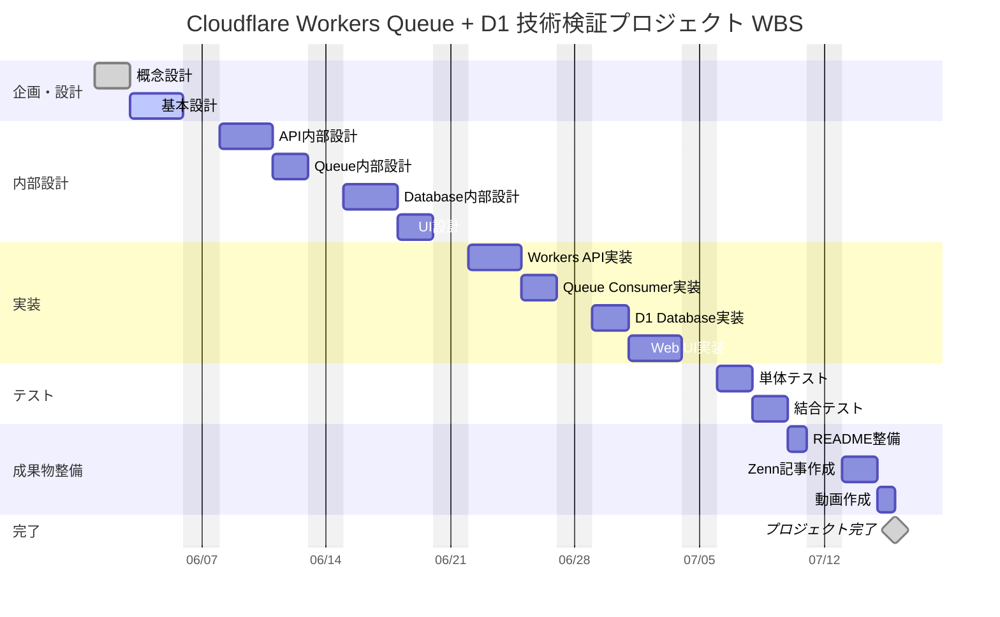

<!-- 表紙 -->

  
Cloudflare Workers Queue + D1 プロジェクト計画書

  
v1.0.0

  
2026-05-29

  

  

  

    © mono-tec Dev
  

#  1. 文書概要

本書は、
Cloudflare Workers / Queue / D1 を利用した
イベント駆動型システムの技術検証プロジェクトについて、
実施方針および計画内容を整理することを目的とする。

本プロジェクトでは、
技術検証と設計テンプレート整備を実施し、
将来の小規模開発へ流用可能な資産として蓄積する。

# 2. プロジェクト概要

## 2.1 プロジェクト名

Cloudflare Workers Queue + D1 技術検証プロジェクト

---

## 2.2 プロジェクト目的

低コストで構築可能なクラウドサービスを利用し、
イベント駆動型システムの基本構成を学習・検証する。

また、
以下成果物を整備し、
将来の技術検証や小規模開発へ流用可能なテンプレートとして活用する。

- 概念設計書
- 基本設計書
- 内部設計書
- ソースコード
- README
- Zenn記事

# 3. プロジェクト体制

| 役割 | 担当 |
|--------|--------|
| プロジェクト責任者 | mono-tec |
| プロジェクトマネージャ | mono-tec |
| 開発担当 | mono-tec |
| テスト担当 | mono-tec |
| ドキュメント作成 | mono-tec |
| AI設計支援 | ChatGPT |
| AIレビュー支援 | ChatGPT |

# 4. QCDS目標

## 4.1 Quality（品質）

以下を満たした場合、
品質目標達成とする。

- 概念設計書作成完了
- 基本設計書作成完了
- 内部設計書作成完了
- イベント送信機能動作
- Queue連携動作
- D1登録動作
- READMEから環境構築可能
- Zenn記事公開

---

## 4.2 Cost（費用）

### 人件費

| 区分 | 金額 |
|--------|--------:|
| 人件費 | 400,000円 |

### AI支援費

| 区分 | 金額 |
|--------|--------:|
| AI設計支援・レビュー支援 | 100,000円 |

### インフラ費

| 区分 | 金額 |
|--------|--------:|
| Cloudflare Free | 0円 |
| GitHub Free | 0円 |

### 諸経費

| 区分 | 金額 |
|--------|--------:|
| 電気代・通信費等 | 10,000円 |

### プロジェクト総額

| 区分 | 金額 |
|--------|--------:|
| 人件費 | 400,000円 |
| AI支援費 | 100,000円 |
| インフラ費 | 0円 |
| 諸経費 | 10,000円 |
| 合計 | 510,000円 |

---

## 4.3 Delivery（納期）

| 項目 | 内容 |
|--------|--------|
| 開始予定日 | 2026-06-01 |
| 完了予定日 | 2026-06-30 |
| 期間 | 1か月 |

---

## 4.4 Scope（対象範囲）

### 対象

- Cloudflare Workers
- Cloudflare Queue
- Cloudflare D1
- Web画面
- API
- Queue処理
- イベント履歴管理

### 対象外

- 本番運用
- 高可用性設計
- 高度認証
- SLA設計
- 大規模負荷試験
- AI機能実装

# 5. 成果物

## 設計書

- concept-design.md
- specifications.md
- internal-api-spec.md
- internal-queue-design.md
- internal-design-db.md
- screen-flow.md

---

## 実装

- Workers API
- Queue Consumer
- D1 Database
- Web UI

---

## ドキュメント

- README.md
- Zenn記事
- 動画（任意）

# 6. コミュニケーション計画

## 6.1 目的

プロジェクト進捗および課題状況を定期的に確認し、
設計・実装・ドキュメント整備を円滑に進める。

## 6.2 コミュニケーション方法

| 項目 | 方法 |
|--------|--------|
| 設計レビュー | ChatGPTとの対話 |
| 技術調査 | ChatGPTとの対話 |
| 実装レビュー | ChatGPTとの対話 |
| 進捗確認 | ChatGPTとの対話 |
| 課題管理 | GitHub Issues またはドキュメント管理 |

## 6.3 レビュータイミング

- 概念設計完了時
- 基本設計完了時
- 内部設計完了時
- 実装完了時
- テスト完了時

# 7. WBS / スケジュール

本プロジェクトでは、
以下の作業順序で技術検証を進める。

---

## 7.1 WBS一覧

| No | フェーズ | 作業 | 期間目安 |
|---|---|---|---|
| 1 | 企画・設計 | 概念設計 | 2日 |
| 2 | 企画・設計 | 基本設計 | 3日 |
| 3 | 内部設計 | API内部設計 | 3日 |
| 4 | 内部設計 | Queue内部設計 | 2日 |
| 5 | 内部設計 | Database内部設計 | 3日 |
| 6 | 内部設計 | UI設計 | 2日 |
| 7 | 実装 | Workers API実装 | 3日 |
| 8 | 実装 | Queue Consumer実装 | 2日 |
| 9 | 実装 | D1 Database実装 | 2日 |
| 10 | 実装 | Web UI実装 | 3日 |
| 11 | テスト | 単体テスト | 2日 |
| 12 | テスト | 結合テスト | 2日 |
| 13 | 成果物整備 | README整備 | 1日 |
| 14 | 成果物整備 | Zenn記事作成 | 2日 |
| 15 | 成果物整備 | 動画作成 | 1日 |

# 8. リスク

| No | リスク | 対応方針 |
|---|---|---|
| 1 | Cloudflare仕様変更 | 公式ドキュメント確認 |
| 2 | 設計と実装の乖離 | 設計書随時更新 |
| 3 | 技術調査不足 | 検証環境で事前確認 |
| 4 | モチベーション低下 | 小単位で区切って進行 |
| 5 | AI回答品質変動 | 人によるレビュー実施 |

# 9. 成功条件

以下を満たした場合、
本プロジェクトを完了とする。

- イベント送信ができる
- Queue登録ができる
- D1保存ができる
- イベント一覧が表示できる
- 設計資料が整備されている
- READMEで再現可能
- Zenn記事公開済み

# 10. 改訂履歴

| 版数 | 改定日 | 内容 |
|------|------|------|
| v1.0.0 | 2026-05-29 | 初版作成 | |