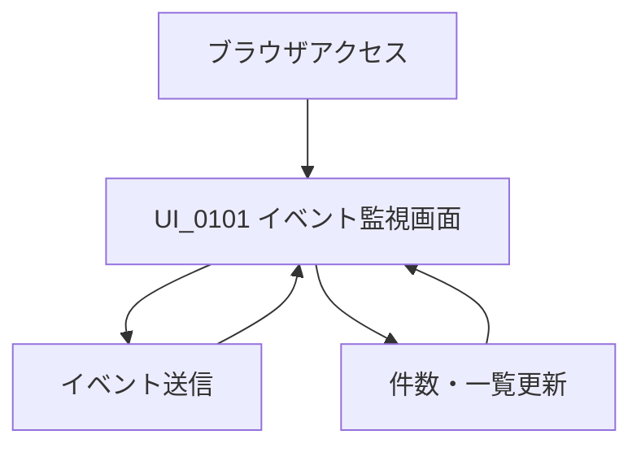
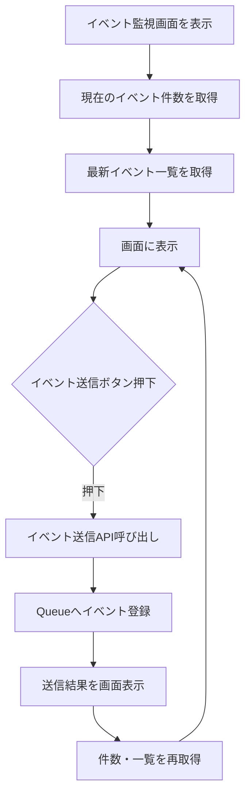

<!-- 表紙 -->

  
Cloudflare Workers Queue + D1 画面遷移図

  
v1.0.0

  
2026-05-29

  

  

  

    © mono-tec Dev
  

<!-- omit from toc -->

# 1. 目的

本書は、
Cloudflare Workers Queue + D1 サンプルにおける
画面遷移を整理することを目的とする。

本システムは検証用の最小構成であるため、
画面は 1 画面構成とする。

# 2. 画面一覧

| 画面ID | 画面名 | 概要 |
|---|---|---|
| UI_0101 | イベント監視画面 | イベント送信、イベント件数表示、最新イベント一覧表示を行う画面 |

# 3. 基本遷移

# 4. 画面内操作フロー

# 5. 遷移ルール

- 本システムは単一画面構成とする
- 画面遷移は発生しない
- イベント送信後は同一画面上で結果を更新する
- 件数および最新イベント一覧は API 経由で取得する
- Queue 処理は非同期で行われるため、送信直後に一覧へ反映されない可能性がある

# 6. 将来拡張

将来的には以下画面の追加を想定できる。

| 画面ID | 画面名 | 内容 |
|---|---|---|
| UI_0201 | イベント一覧画面 | イベント履歴を一覧表示する |
| UI_0202 | イベント詳細画面 | イベント詳細情報を表示する |
| UI_0301 | 設定画面 | Queue / D1 / 表示条件などの設定を行う |

# 7. 改訂履歴

| 版数 | 改定日 | 内容 |
|---|---|---|
| v1.0.0 | 2026-05-30 | 初版作成 |