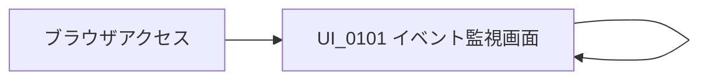

<!-- 表紙 -->
<div class="cover">
  <div class="title">UI_0101 イベント監視画面<BR>画面設計書</div>
  <div class="version">v1.0.0</div>
  <div class="date">2026-05-29</div>
  <div class="logo">


  </div>
  <div class="copyright">
    © mono-tec Dev
  </div>
</div>

<!-- omit from toc -->

# 1. 概要・目的

| 項目    | 内容                                 |
| ----- | ---------------------------------- |
| 画面ID  | UI_0101                            |
| 画面名   | イベント監視画面                           |
| 目的    | 疑似イベントの送信、イベント件数の確認、最新イベント一覧の確認を行う |
| 利用者   | 技術検証者、開発者                          |
| 画面種別  | 検証用画面                              |
| 関連API | イベント送信API、イベント件数取得API、イベント一覧取得API  |

本画面は、
Cloudflare Workers / Queue / D1 を利用した
イベント駆動型システムの動作確認を行うための画面である。

利用者は本画面から疑似イベントを送信し、
Queue 経由で処理されたイベント情報を画面上で確認する。

# 2. 画面イメージ

```text
+--------------------------------------------------+
| Cloudflare Queue + D1 Sample                     |
+--------------------------------------------------+

[イベント送信]

イベント件数：
123

最新イベント一覧
----------------------------------------------------
| 発生日時              | 種別          | メッセージ |
|-----------------------|---------------|------------|
| 2026/05/30 10:00:00   | button_click  | sample     |
| 2026/05/30 10:00:05   | button_click  | sample     |
| 2026/05/30 10:00:10   | button_click  | sample     |
```

# 3. コントロール仕様

| No | ControlID          | 種別   | 表示名                          | I/O | 内容            |
| -- | ------------------ | ---- | ---------------------------- | --- | ------------- |
| 1  | lblTitle           | ラベル  | Cloudflare Queue + D1 Sample | 表示  | 画面タイトル        |
| 2  | btnSendEvent       | ボタン  | イベント送信                       | 入力  | 疑似イベントを送信する   |
| 3  | lblEventCountTitle | ラベル  | イベント件数                       | 表示  | 件数表示項目名       |
| 4  | lblEventCount      | ラベル  | -                            | 表示  | 登録済みイベント件数    |
| 5  | tblEventList       | テーブル | 最新イベント一覧                     | 表示  | 最新イベント一覧      |
| 6  | lblMessage         | ラベル  | -                            | 表示  | 処理結果やエラーメッセージ |

# 4. 表示項目仕様

## 4.1 イベント件数

| 項目      | 内容                         |
| ------- | -------------------------- |
| 表示内容    | D1 Database に保存されているイベント件数 |
| 取得方法    | イベント件数取得API                |
| 更新タイミング | 画面表示時、イベント送信後、更新処理実行時      |

---

## 4.2 最新イベント一覧

| 項目   | 内容          |
| ---- | ----------- |
| 表示内容 | 最新イベント情報    |
| 取得方法 | イベント一覧取得API |
| 表示件数 | 最大10件       |
| 並び順  | 発生日時の降順     |

### 表示カラム

| No | 項目    | 内容             |
| -- | ----- | -------------- |
| 1  | 発生日時  | イベント発生日時       |
| 2  | 種別    | イベント種別         |
| 3  | メッセージ | イベントに付随するメッセージ |

# 5. イベント仕様

## 5.1 画面表示時

### トリガ

画面初期表示時

### 処理内容

1. イベント件数取得APIを呼び出す
2. 最新イベント一覧取得APIを呼び出す
3. 取得結果を画面に表示する

### 異常時

API呼び出しに失敗した場合、
エラーメッセージを画面に表示する。

---

## 5.2 イベント送信ボタン押下

### トリガ

`btnSendEvent` 押下時

### 処理内容

1. イベント送信APIを呼び出す
2. 疑似イベントを送信する
3. API応答結果を画面に表示する
4. イベント件数を再取得する
5. 最新イベント一覧を再取得する

### 送信イベント例

```json
{
  "eventType": "button_click",
  "message": "sample event",
  "payload": {
    "source": "web-ui"
  }
}
```

### 注意事項

Queue 処理は非同期で行われるため、
イベント送信直後に最新イベント一覧へ反映されない場合がある。

# 6. バリデーション仕様

本画面では、
利用者が任意入力する項目は設けない。

そのため、
画面入力値に対するバリデーションは実施しない。

ただし、
API送信時に必要な固定値については、
JavaScript 側で生成する。

# 7. メッセージ仕様

| コード     | メッセージ例            | 表示タイミング      |
| ------- | ----------------- | ------------ |
| INF-001 | イベントを送信しました。      | イベント送信API成功時 |
| INF-002 | 最新情報を取得しました。      | 件数・一覧取得成功時   |
| ERR-001 | イベント送信に失敗しました。    | イベント送信API失敗時 |
| ERR-002 | イベント件数の取得に失敗しました。 | 件数取得API失敗時   |
| ERR-003 | イベント一覧の取得に失敗しました。 | 一覧取得API失敗時   |

# 8. API連携概要

| 処理     | API                   | 用途              |
| ------ | --------------------- | --------------- |
| イベント送信 | POST /api/events      | 疑似イベントを送信する     |
| 件数取得   | GET /api/events/count | 登録済みイベント件数を取得する |
| 一覧取得   | GET /api/events       | 最新イベント一覧を取得する   |

API の詳細仕様は、
別紙「API内部設計書」にて定義する。

# 9. 画面遷移

本画面は単一画面構成のため、
画面遷移は発生しない。



# 10. テスト観点

| No | テスト項目  | 確認内容                    |
| -- | ------ | ----------------------- |
| 1  | 初期表示   | 画面が表示されること              |
| 2  | 件数取得   | イベント件数が表示されること          |
| 3  | 一覧取得   | 最新イベント一覧が表示されること        |
| 4  | イベント送信 | イベント送信APIが呼び出されること      |
| 5  | 送信後更新  | 送信後に件数・一覧が再取得されること      |
| 6  | API異常  | API失敗時にエラーメッセージが表示されること |

# 11. 将来検討項目

| No | 項目       | 内容                 |
| -- | -------- | ------------------ |
| 1  | 手動更新ボタン  | 件数・一覧を任意タイミングで更新する |
| 2  | イベント種別選択 | 送信するイベント種別を選択可能にする |
| 3  | メッセージ入力  | 任意メッセージを入力可能にする    |
| 4  | イベント詳細表示 | 一覧から詳細情報を確認可能にする   |
| 5  | 自動更新     | 一定間隔で件数・一覧を更新する    |

# 12. 改訂履歴

| 版数     | 改定日        | 内容   |
| ------ | ---------- | ---- |
| v1.0.0 | 2026-05-30 | 初版作成 |
